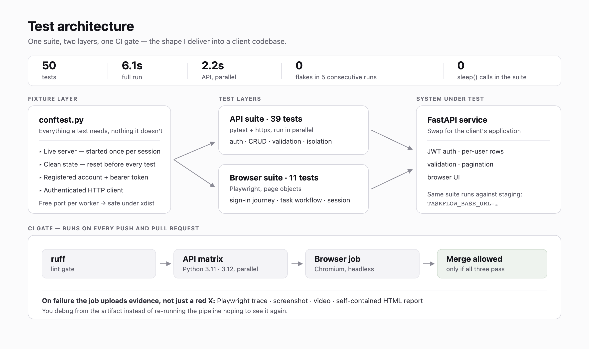
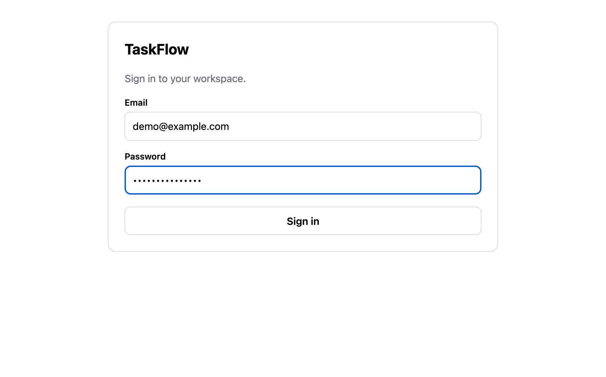
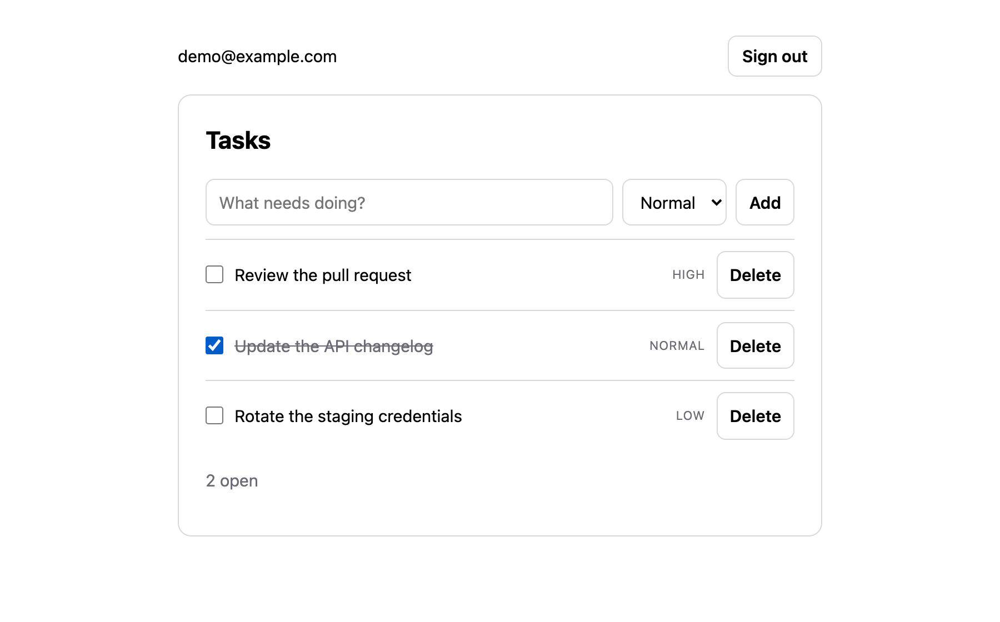

# End-to-End Test Automation — Reference Implementation

A complete, runnable test suite for a small web service: **50 tests covering the
HTTP API and the browser UI, running in ~6 seconds, wired into GitHub Actions so
a broken build never reaches `main`.**

I build this for teams that have a working product and no safety net. This
repository is the shape of what I deliver — the same layout, fixtures, and CI
wiring, applied to your codebase instead of a demo one.

```
$ pytest
50 passed in 6.00s

$ pytest -m api -n auto
39 passed in 2.18s
```

The suite ran 5 consecutive times with zero flaky failures. That is the number
that matters: a suite people don't trust gets switched off within a month.



---

## What is here

| Path | What it is |
|---|---|
| `app/` | The system under test — FastAPI service with JWT auth, per-user data, validation, pagination, and a small browser UI |
| `tests/api/` | 39 HTTP-level tests: auth contract, CRUD, pagination, input validation, tenant isolation |
| `tests/e2e/` | 11 Playwright tests: sign-in journey, task workflow, session handling |
| `tests/pages/` | Page objects — every selector lives here and nowhere else |
| `tests/conftest.py` | Live-server, clean-state, and authenticated-client fixtures |
| `.github/workflows/ci.yml` | Lint + API matrix (3.11/3.12) + browser job, with failure artifacts |

The application is deliberately small. The test architecture is not — that is
the part you are hiring for.

| | |
|---|---|
|  |  |

*The system under test. Every interactive element carries a stable
`data-testid`, so the page objects never depend on CSS classes or copy.*

## Decisions worth pointing at

**The server starts once; the data resets between tests.** Restarting a process
per test is the usual reason suites take twenty minutes. State is cleared
through a reset endpoint that only mounts when `TASKFLOW_TEST_MODE=1`, so it
cannot exist in production. See `tests/conftest.py`.

**Browser tests authenticate over the API, not through the login form.** If the
login page breaks, exactly one test fails — the one that tests login — instead
of all eleven. Setup through the UI is the single biggest source of misleading
red builds.

**Waits belong in the page object, not in the tests.** `TasksPage.add()` returns
only once the list reflects the new row. During development this repository had
a genuine race — the form clears itself asynchronously after the POST resolves,
so a second `fill()` could be wiped mid-typing. It is fixed in one place. There
is not a single `sleep()` in the suite.

**Authorization is tested as its own concern.** `tests/api/test_tenant_isolation.py`
asserts that another user's record returns `404`, not `403` — a `403` confirms
the row exists. It also checks that a rejected cross-tenant write leaves the
original row untouched.

**Validation gets real coverage.** Boundary cases (140 characters valid, 141
rejected), malformed payloads, and out-of-range pagination parameters are
parametrised rather than hand-written, so the failure IDs read as
`[title-too-long]` rather than `[3]`.

**CI publishes evidence, not just a red X.** Failed browser runs upload the
Playwright trace, a screenshot, and a video. You debug from the artifact instead
of re-running the job hoping to see it again.

## Running it

```bash
make install    # venv, dependencies, Chromium
make test       # everything
make api        # HTTP suite only, parallel
make e2e        # browser suite, traces retained on failure
make headed     # watch the browser drive itself
make report     # self-contained HTML report in reports/
```

Point the same suite at a deployed environment instead of a local server:

```bash
TASKFLOW_BASE_URL=https://staging.example.com pytest -m api
```

## Stack

`pytest` · `Playwright` · `httpx` · `pytest-xdist` · `ruff` · `GitHub Actions`
· `FastAPI` (system under test)

Selenium on request — I have shipped both; Playwright is the better default for
new work.

## Working with me

I take on scoped, fixed-price test-automation engagements: you get a suite in
this shape against your own application, running in your CI, plus a short
handover document so your team can extend it.

**Berkay Şahin** — Backend & Test Automation Engineer
Python · FastAPI/Flask · pytest · Playwright · Selenium · Docker · CI/CD
[github.com/berkaysahin1](https://github.com/berkaysahin1) · [linkedin.com/in/berkay-sahin](https://linkedin.com/in/berkay-sahin) · berkaysah@outlook.com
